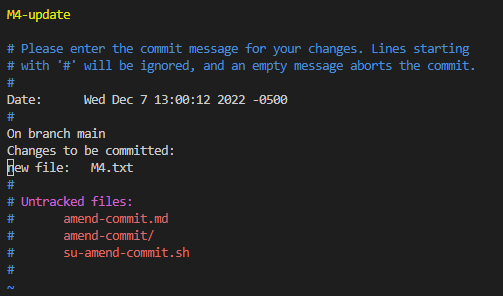
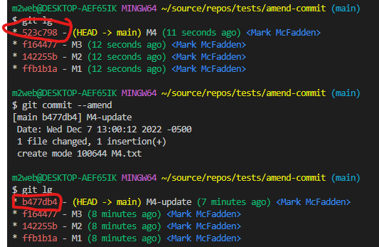
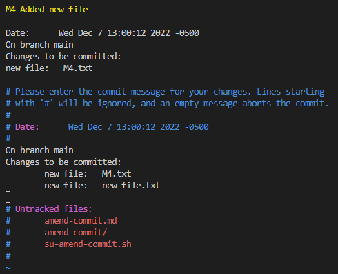
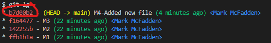

# Changing the Last Commit

## Change Commit Message

To demonstrate how to change your last commmit, let us assume we have a repository with the following branch state:

```bash
    M1 <- M2 <- M3 <- M4
```

Here is what we have and what we want: 

We want to change the commit message of M4 to "M4 - Fixed typo". To do this, we can use the `git commit --amend` command:

```bash
git commit --amend
```

This will open your default editor with the commit message of M4. You can change the message and save the file. The commit message will be changed to the new message.

Here is what I did:



Given I am using VI as my default editor, I can use the following command to change the commit message:

```bash
:wq # to save and quit
```

Now, our Git history will look like:

```bash
    M1 <- M2 <- M3 <- M4-update
```

Also, note that the amended commit will have a different SHA-1 hash than the original commit hash of `523c798` as it is a new commit:



## Change Commit Content

If you want to change the actual content of your last commit, the steps are the same. First, make the changes you think you forgot, stage those changes, and the subsequent git commit --amend replaces that last commit with your new, improved commit.

So, let's add a new file to our repository:

```bash
echo "This is a new file" > new-file.txt
git add new-file.txt
git commit --amend
```

Here is the edited commit message:



Again, note that the amended commit will have a different SHA-1 hash than the original commit hash of `b477db4` as it is a new commit:



Now, our Git history looks like:

```bash
    M1 <- M2 <- M3 <- M4-Added new file
```

Enjoy!
