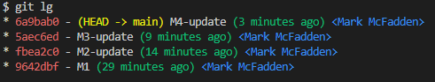

# Changing Multiple Commits

Let us assume we have a repository with the following branch state:

```bash
    M1 <- M2 <- M3 <- M4
```

Here is what we have and what we want:


Here is our initial Git history:


To modify a commit that is farther back in your history, you can use the rebase tool to rebase a series of commits onto the HEAD that they were originally based on instead of moving them to another one. You can run rebase interactively by adding the -i option to `git rebase` that looks like this:

```bash
git rebase -i HEAD~3
```

Note the ~3 that follows the HEAD. Here, I am indicating how far back you want to rewrite commits by telling the command which commit to rebase onto, which is in this case, the HEAD of the M2 commit. It may be easier to remember the ~3 notation as trying to include the last 3 commits.

When issuing the command `git rebase -i HEAD~3`, you will see a list of commits that you are about to rebase:


Notice the reverse order of the commits here. The interactive rebase provides you a script that will start at the commit you specify on the command line (HEAD~3) and replay the changes introduced in each of these commits from top to bottom. It lists the oldest at the top, because that’s the first one it will replay.

I updated the commands from pick to edit for each commit, so that it stops at the commit and allows me to edit that commit.


After saving the file and exiting the editor, you will be taken to the commit message of the first commit in the list.


I then issue the command `git commit --amend` to change the commit message of M2.


Then, I issue the command `git rebase --continue` to continue the rebase.


So, now let's add a new file to our M3 commit and also amend the commit message:

```bash
echo "This is a new file" > new-file.txt
git add new-file.txt
git commit --amend
```

Here is the edited commit message:


Then, after saving the edits, I issue the command `git rebase --continue` to continue the rebase.


Now, let's add a new file to our M4 commit and amend the commit message:

```bash
echo "This is a new file again" > new-file2.txt
git add new-file2.txt
git commit --amend
```

Here is the edited commit message:


Then, after saving the edits, I issue the command `git rebase --continue` to continue the rebase.

Now, our Git history will look like:

```bash
    M1 <- M2-update <- M3-update <- M4-update
```

Note that the amended commits (M2, M3, and M4) will have a different SHA-1 hash than the original commit hash as it is a new commit:



Finally, notice that the M1 commit still has the same SHA-1 hash, `9642dbf`, as it was not changed.

Remember that this is a rebasing command where every commit in the range HEAD~3..HEAD with a changed message/content and all of its descendants will be rewritten. **Don’t push any commit that you’ve already pushed to a central server as doing so will confuse other developers by providing an alternate version of the same commit**.

Enjoy!
