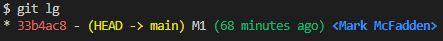

# cherry-pick Many Commits

We start with 2 branches, main and feature.

Here is the main branch:



Note the alias `lg` command above. In my user account's folder, I have a .gitconfig file that has the following: 

```bash
lg = log --color --graph --pretty=format:'%Cred%h%Creset -%C(yellow)%d%Creset %s %Cgreen(%cr) %C(bold blue)<%an>%Creset' --abbrev-commit 
```

Looking at the feature branch:


OK. Here is what we have and what we want:


Let's pick commits 2451792 (F3) through 145d107 (F5) from the feature branch and apply them to the main branch.

```bash
git cherry-pick 2451792^..145d107
```

The `^` is used to indicate the parent of the commit. The `..` is used to indicate a range of commits. Here is output now of the main branch:


Note that the feature branch is still has the same F3 to F5 as the commits as before:


You can clean up the feature branch by doing a `get checkout feature` and then `git reset --hard ffa5cb2` and remove the commits that were cherry-picked. Here is the feature branch after the reset:


Enjoy!
