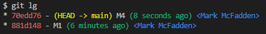

# Dropping (Deleting) Commits

To demonstrate how to drop (delete) commmits, let us assume we have a repository with the following branch state:

```bash
    M1 <- M2 <- M3 <- M4
```

Here is what we have and what we want:


Here is the history of our repository:


We want to drop commmits M2 and M3. To do this, we can use the `git rebase -i HEAD~3` command to include M2, M3, and M4:

```bash
git rebase -i HEAD~3
```

Note the ~3 that follows the HEAD. Here, I am indicating how far back you want to rewrite commits by telling the command which commit to rebase onto, which is in this case, the HEAD of the M2 commit. It may be easier to remember the ~3 notation as trying to include the last 3 commits.

This will open your default editor with the following content:


Notice the reverse order of the commits here. The interactive rebase provides you a script that will start at the commit you specify on the command line (HEAD~3) and replay the changes introduced in each of these commits from top to bottom. It lists the oldest at the top, because that’s the first one it will replay.

As you can see from above, I mark the M2 and M3 commits with the `d` or `drop` and save the file. This will drop the M2 and M3 commits from the history.


After saving the file, the rebase will drop the M2 and M3 commits.

Here is the new history of our repository:



```bash
    M1 <- M4
```

Enjoy!
