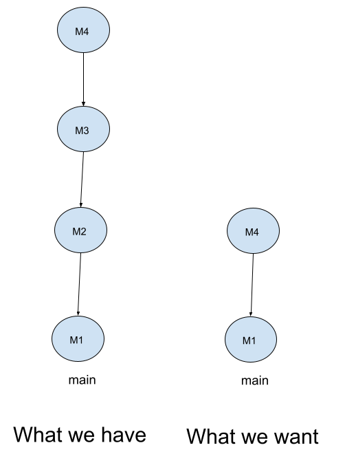

# Dropping Commits

To demonstrate how to drop commmits, let us assume we have a repository with the following branch state:

```bash
    M1 <- M2 <- M3 <- M4
```

Here is what we have and what we want:



Here is the history of our repository:


We want to drop commmits M2 and M3. To do this, we can use the `git rebase -i HEAD~3` command to include M2, M3, and M4:

```bash
git rebase -i HEAD~3
```

This will open your default editor with the following content:


As you can see from above, I mark the M2 and M3 commits with the `d` or `drop` and save the file. This will drop the M2 and M3 commits from the history.


After saving the file, the rebase will drop the M2 and M3 commits.

Here is the new history of our repository:


```bash
    M1 <- M4
```

Enjoy!
