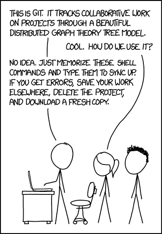
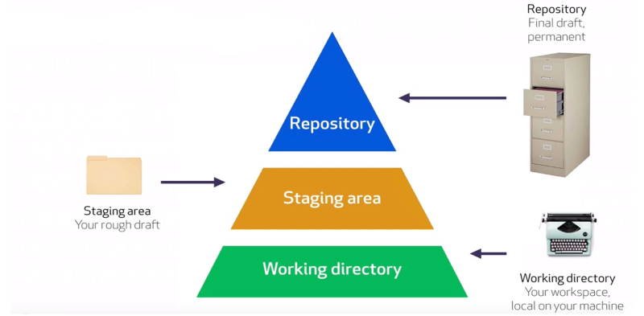
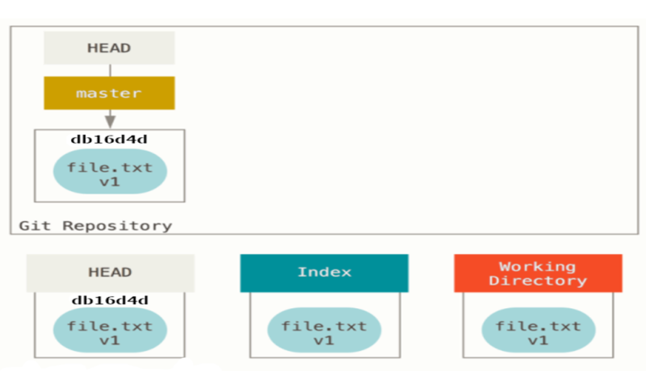
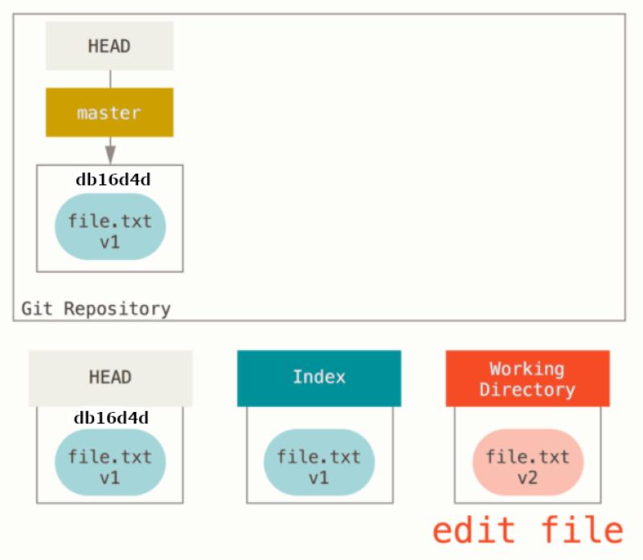
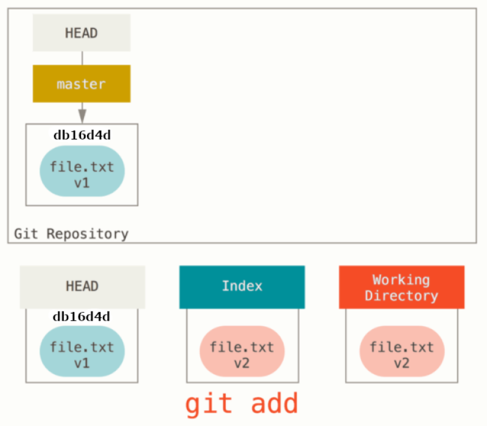
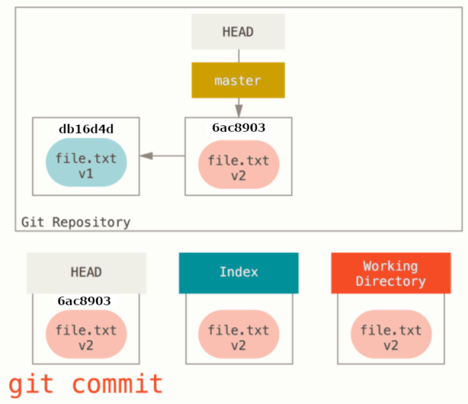

# Git - Data Model, Areas, and States



Because of Git's thin abstraction and history, learning Git top-down can lead to a lot of misunderstandings. While it's possible to memorize a handful of commands, you end up treating Git as a set of magic spells and following the approach in the comic above whenever there are issues with your repository.

Moreover, `a set of commands have to be memorized`, while `Git's data model can be understood`. 

## Git's Data Model

Let's consider a traditional folder/file structure:

```bash
<C:\>
|
+- myFolder
|  |
|  + hello.txt (contents = "hello world")
|
+- git-is-great.txt (contents = "git is awesome")
```

Above, we have the root folder (C:\) that contains the myFolder folder and a file named git-is-great.txt. The myFolder folder contains a file named hello.txt.

Let's compare that to the Git data model:

```bash
<C:\> (tree)
|
+- myFolder (tree)
|  |
|  + hello.txt (blob, contents = "hello world")
|
+- git-is-great.txt (blob, contents = "git is awesome")
```

Above, the root folder (C:\) is a tree object that contains the myFolder tree object and a blob named git-is-great.txt. The myFolder tree contains a blob named hello.txt.

### The cat-file command
Now, we will create a local repository:
$ git init myrepo

Add a blob object:

```bash
$ echo "Once more unto the breach dear friends, once more." > test.txt
24941f46f1b778a70a22424eb4c26fbefe629ea8
```

Let's investigate the object content with the git cat-file command:

```bash
$ git cat-file -p 24941f46f1b778a70a22424eb4c26fbefe629ea8
Once more unto the breach dear friends, once more.
```

Let's look at the type of git object for our new object:

```bash
$ git cat-file -t 24941f46f1b778a70a22424eb4c26fbefe629ea8
blob
```

Next, let's look at the concept of a snapshot.

### Modeling History: Snapshots

```bash
O <-- O <-- O <-- O <---- 0
            ^            /
             \          v
              --- O <-- O
```

In the ASCII art above, the 'Os' correspond to individual commits (snapshots). The arrows point to the parent of each commit in that it comes before the commit and not after. After the third commit, the history branches into two separate branches. This might correspond to a new feature being developed in parallel and independently from the main branch. These branches then merge to create a new snapshot that incorporates both code bases, producing a new snapshot with the newly created commit shown as a zero.

For Git, a history is a directed acyclic graph (DAG) of snapshots. What this means is that each snapshot refers to a set of "parents", the snapshots that preceded it, rather than a single parent because a snapshot might descend from multiple parents, for example, due to the combining or merging of two parallel branches, as shown above as the zero snapshot.

### Representing the Git Data Model as Pseudocode

```java
// a file is a bunch of bytes
var blob = array<byte>

// a directory contains named files and directories
var tree = map<string, tree | blob>

// a commit has parents, metadata, and the top-level tree
var commit = struct {
    parents: array<commit>,
    author: string,
    committer: string,
    message: string,
    snapshot: tree
}
```

Given the above pseudocode, an "object" is a blob, tree, or commit:

```java
var object = blob | tree | commit

In Git, all objects are content-addressed by their SHA-1 hash.

objects = map<string, object>

void store(object){
    id = sha1(object)
    object[id] = object
}

object load(object, id){
    return object[id]
}
```

Blobs, trees, and commits are unified in this way: they are all objects. When Git objects are referenced, they don't reference their full, on-disk representation, but rather reference to them by their hash string.

### References

Using SHA-1 hashes is inconvenient because humans aren't good at remembering strings of 40 hexadecimal characters. Git's solution to this problem is human-readable names for SHA-1 hashes, called "references". 

References are pointers to commits. Unlike objects, which are immutable, references are mutable and therefore can be updated to point to a new commit. For example, the master reference usually points to the latest commit in the main branch of development.

```java
references = map<string, string>

void update_reference(reference, name, id){
    references[name] = id
}

string read_reference(reference, name){
    return references[name]
}

string load_reference(reference, name_or_id){
    if (name_or_id in references){
        return load(references[name_or_id])
    } else {
        return load(name_or_id)
    }
}
```

With the above, Git can use human-readable references like "master" instead of a long hexadecimal string.

Often we want a notion of "where we currently are" in the history. In Git, that "where we currently are" is a special reference called "HEAD".

### Repositories

Finally, we can roughly define a Git repository: it is the data objects and references.

On disk, all Git stores are objects and references: that's all there is to Git's data model. All git commands map to some manipulation of the commit DAG by adding objects and adding/updating references.

### So What?

Whenever you're typing in any command or using a GUI, think about what manipulation the operation is making to the underlying graph data structure. Conversely, if you're trying to make a particular kind of change such as "discard uncommitted changes and make the 'master' ref point to commit 5d83f9e", there's probably a command to do it (e.g. in this case, git checkout master; git reset --hard 5d83f9e).

## Git's Three 'Areas'



## Git's Three States

Git has three main states that your files can reside in: modified, staged, and committed:
* Modified means that you have changed the file but have not committed it to your database yet.
* Staged means that you have marked a modified file in its current version to go into your next commit snapshot.
* Committed means that the data is safely stored in your local database.

The basic Git workflow goes something like this:

1. You modify files in your working tree.
2. You selectively stage just those changes you want to be part of your next commit, which adds only those changes to the staging area.
3. You do a commit, which takes the files as they are in the staging area and stores that snapshot permanently to your Git directory.

For example, here is our starting state:



We then update our file.txt file:



Once we are done editing the file, let's place it into stage:



Next, let's commit what is in stage to our repo:



See more at https://missing.csail.mit.edu/2020/version-control/
