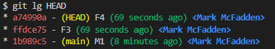

# rebase --onto

We start with 2 branches, main and feature.

Here is the main branch:


Note the alias `lg` command above. In my user account's folder, I have a .gitconfig file that has the following:

```bash
lg = log --color --graph --pretty=format:'%Cred%h%Creset -%C(yellow)%d%Creset %s %Cgreen(%cr) %C(bold blue)<%an>%Creset' --abbrev-commit 
```

Looking at the feature branch:


OK. Here is what we have and what we want:


Let's rebase the child of ddddadc (F2) which is c7003ce (F3) and through e1ce6c0 (F4) from the feature branch and apply them to the main branch. Or, in other words, let's change the parent of F3 from ddddadc to 1b989c5 and include e1ce6c0 (F4) :

```bash
git rebase --onto 1b989c5 ddddadc e1ce6c0
```

Now, when we issue a `git status` we see that the HEAD, where we are, is now detached. This is because we are not on any branch.


Let's look at the log for HEAD:



We are in a state of limbo. This is a good time to can create a new temporary branch from this state and then merge it back into the desired branch. Let's create a new branch called `temp-branch`.

```bash
# create a new branch from the detached HEAD with a new commit object that is currently the tip of HEAD. 
git branch temp-branch a74990a
```

We can now merge this branch back into another branch, in our case, the main branch. First, make sure to checkout the main branch, then merge the temp branch into it, and then delete the temp branch.

```bash
git checkout main
git merge temp-branch
git branch -d temp-branch
```

<!-- interactive rebase removing feature branch commits F3 through F5 -->
Now we need to remove the commits from the feature branch. We can do this with an interactive rebase. We will start with the F2 commit (ddddadc):

```bash
git rebase -i ddddadc
```

Next, we will drop the commits we no longer want on the feature branch. We will drop F3 (582b7ff), F4 (e1ce6c0), and F5 (c31dde8). Here is what my edits look like vi the `vi` editor:

```bash
drop 58b27ff F3
drop e1ce6c0 F4
drop c31dde8 F5
```

After saving the edits, we see that the commits have been removed from the feature branch:


Now, let's look at the log for the main branch:


Finally, here is a view from Gitkrakens `GitLens` Visual Studio Code extension:


Enjoy!
