# Reordering Commits

## Remove Commit

To demonstrate how to remove an unwanted commmit, let us assume we have a repository with the following branch state:

```bash
    M1 <- M2 <- M3 <- M4
```

Here is what we have and what we want:

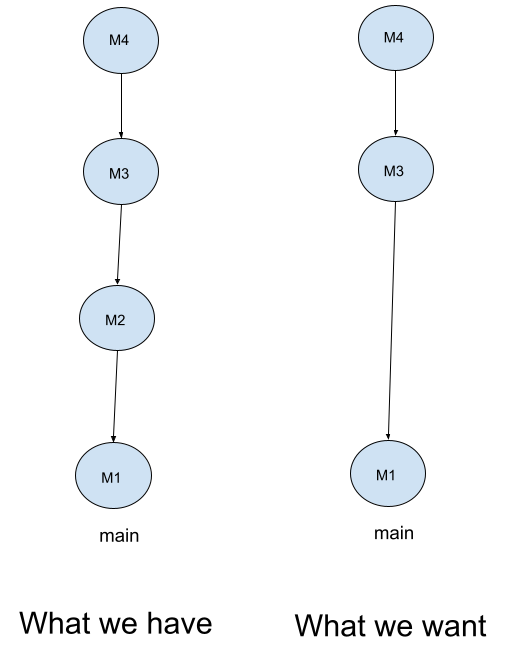

Here is the history of our repository:

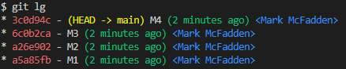

We want to remove the commit M2. To do this, we can use the `git rebase -i HEAD~3` command to include M2, M3, and M4:

```bash
git rebase -i HEAD~3
```

This will open your default editor with the following content:

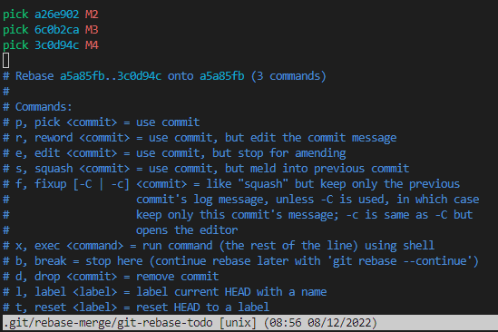

I then remove the line with M2 and save the file. This will remove the commit M2 from the history.

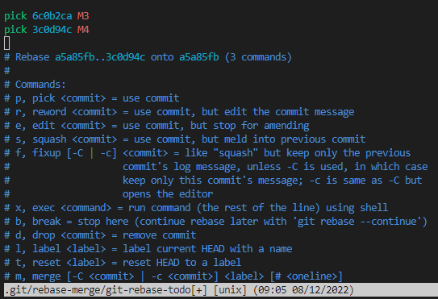

Here is the new history of our repository:

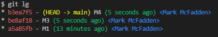

```bash
    M1 <- M3 <- M4
```

## Reorder Commits

To demonstrate how to reorder commits, let us assume we have a repository with the following branch state:

```bash
    M1 <- M2 <- M3 <- M4
```

Here is the history of our repository:


Here is what we have and what we want:

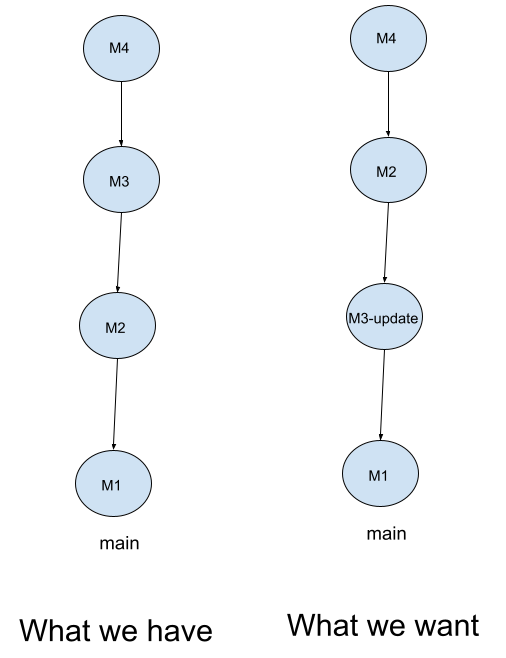

We want to reorder the commits M2 and M3 and ammend M3's commit message. To do this, we can use the `git rebase -i HEAD~3` command to include M2, M3, and M4:

```bash
git rebase -i HEAD~3
```

This will open your default editor with the following content:


Here, we will change the order of the commits with our editor. We will move M3 above M2. We will also change the commit message of M3:

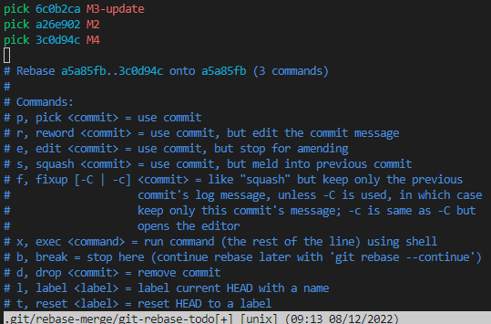

We will save the file which will reorder the commits:

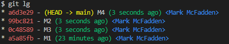

```bash
    M1 <- M3 <- M2 <- M4
```

Now we want to change the commit message of M3. To do this, we can use the `git rebase -i HEAD~3` command again to include M2, M3, and M4:

```bash
git rebase -i HEAD~3
```

Then, I will change the `pick` to `edit` for M3, so that we can change the commit message and then save the file:

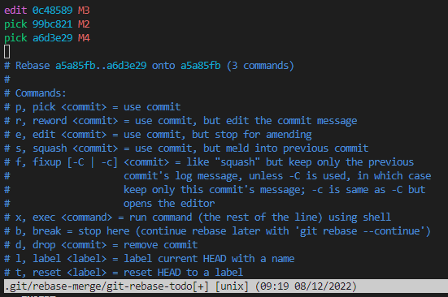

I then issue the following command to change the commit message:

```bash
git commit --amend
```

I then update the commit message:

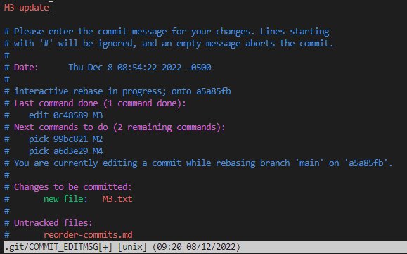

I then save the file and exit the editor. This will update the commit message of M3:

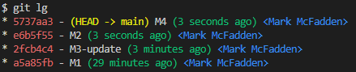

Enjoy!
