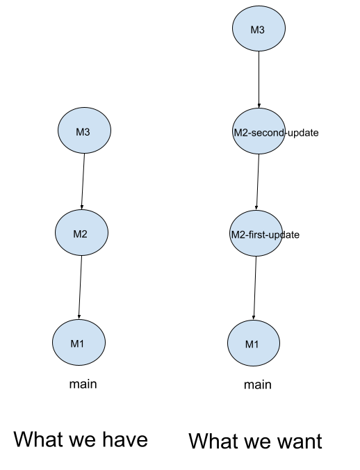
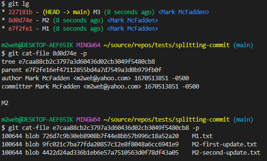
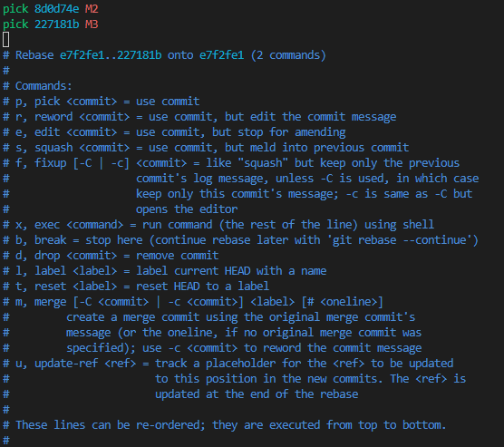
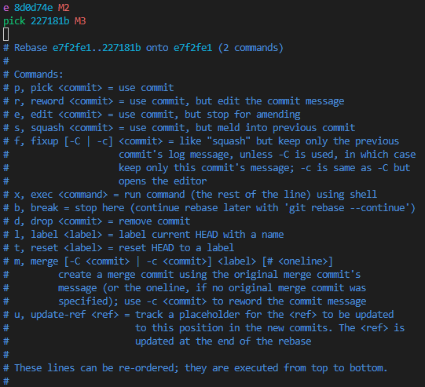
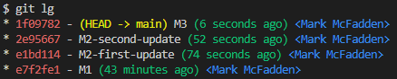

# Splitting Commits

To demonstrate how to split a commmit, let us assume we have a repository with the following branch state:

```bash
    M1 <- M2 <- M3
```

Here is what we have and what we want:



Here is the history of our repository, along with the content of M2 via the `git cat-file 8d0d74e -p` command:



As you can see from above, M2 contains M2-first-update.txt and M2-second-update.txt. We want to split M2 into two commits: M2-first-update and M2-second-update. To do this, we can use the `git rebase -i HEAD~2` command to include M1 and M2:

```bash
git rebase -i HEAD~2
```

Note the ~2 that follows the HEAD. Here, I am indicating how far back you want to rewrite commits by telling the command which commit to rebase onto, which is in this case, the HEAD of the M2 commit. It may be easier to remember the ~2 notation as trying to include the last 2 commits.

This will open your default editor with the following content:



Notice the reverse order of the commits here. The interactive rebase provides you a script that will start at the commit you specify on the command line (HEAD~2) and replay the changes introduced in each of these commits from top to bottom. It lists the oldest at the top, because that’s the first one it will replay.

From here we will edit the M2 commit:



Then, when the rebase script drops you to the command line, you reset that commit, take the changes that have been reset, and create multiple commits out of them. When you save and exit the editor, Git rewinds to the parent of the first commit in your list, applies the first commit (e7f2fe1) and drops you to the console. There, you can do a mixed reset of that commit with `git reset HEAD^`, which effectively undoes that commit and leaves the modified files unstaged. Now you can stage and commit files until you have several commits, and run `git rebase --continue` when you’re done:

```bash
git reset HEAD^
git add M2-first-update.txt
git commit -m "M2-first-update"
git add M2-second-update.txt
git commit -m "M2-second-update"
git rebase --continue
```

Now, we have the following history:



```bash
    M1 <- M2-first-update <- M2-second-update <- M3
```

Enjoy!
