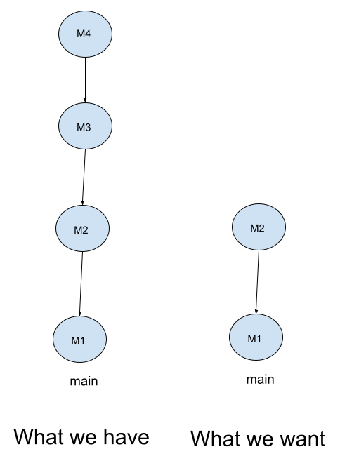
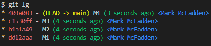
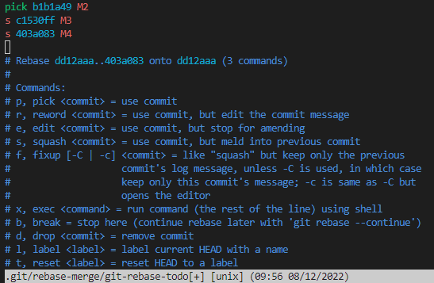
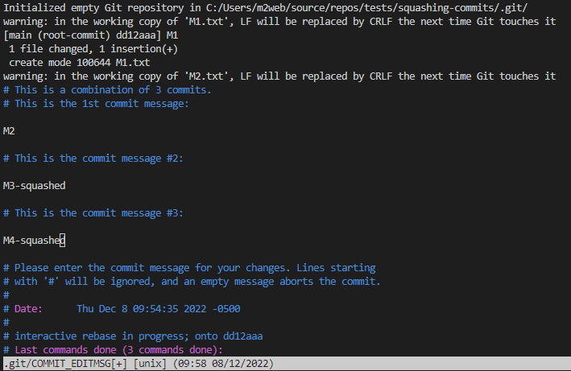
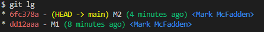
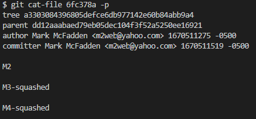
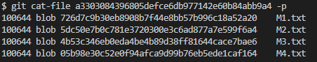

# Squashing Commits

To demonstrate how to squash commmits, let us assume we have a repository with the following branch state:

```bash
    M1 <- M2 <- M3 <- M4
```

Here is what we have and what we want:



Here is the history of our repository:



We want to squash or combine commmits M3 and M4. To do this, we can use the `git rebase -i HEAD~3` command to include M2, M3, and M4:

```bash
git rebase -i HEAD~3
```

This will open your default editor with the following content:



As you can see from above, I mark the M3 and M4 commits with the `s` or `squash` and save the file. This will squash commits M3 and M4. From here, I will update the commit message of M3 and M4. I will then save the file and exit the editor. This will update the commit message of M3 and M4:



Here is the new history of our repository:



```bash
    M1 <- M2
```

Let's look at the M2 commit content via the `git cat-file 6fc378a -p` command:



What we see is the content of M3-squashed and M4-squashed is now included in the M2 commit. This is because we squashed M3 and M4 into M2.

If we look at the a3303084396805defce6db977142e60b84abb9a4 tree, we will see the content of M3 (M3.txt) and M4 (M4.txt):



Enjoy!
